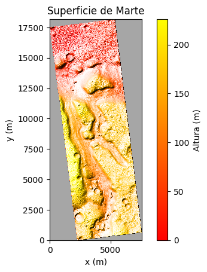
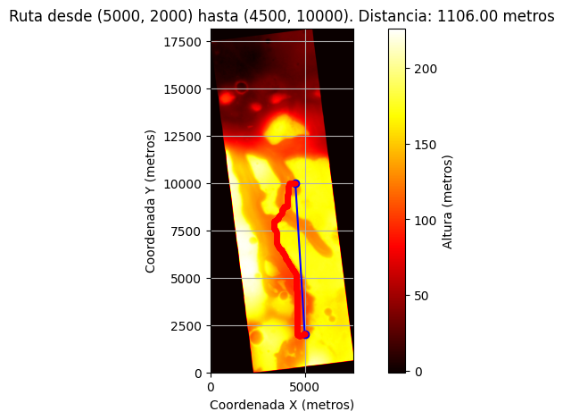

# Mars Rover Pathfinding Algorithms

This project implements different search algorithms (A*, greedy, iterative deepening, BFS) to find the optimal path for a Mars rover, considering terrain data from NASA. The goal is to navigate from one coordinate to another while accounting for the terrain's relief.

*Figure 1: Surface of Mars.*

## Algorithms Implemented
- A* Search
- Greedy Search
- Iterative Deepening Search
- Breadth-First Search (BFS)

## Results
Several important questions were answered through this project:

1. **Which algorithms found a valid route?**
   - All four algorithms found valid routes. However, the performance varied: A* and BFS found the shortest paths, while the iterative deepening search was the least efficient.

2. **Is it necessary to use informed searches in this case?**
   - No. Both uninformed searches successfully reached the goal, and BFS performed as well or better than the informed methods.

3. **What heuristic function was suitable for this problem?**
   - The heuristic used in the informed methods was the Manhattan distance, which takes into account both horizontal distance and elevation differences between nodes, guiding the algorithms toward shorter paths.

4. **In what cases can the algorithm solve the problem in an acceptable time?**
   - The algorithms perform efficiently when the distance traveled is under 1000 meters. For distances over 1000 meters, the code may need to be run multiple times for acceptable results.

5. **When the algorithm fails to find a result, what can be done to help?**
   - Optimization can be applied by improving node selection or using more advanced search methods. Additionally, enhancing the rover’s sensory data or navigation system could lead to better performance.

## Explorations with A*
- Pathfinding for coordinates less than 500m apart
- Pathfinding for distances between 1000m and 1500m
- Pathfinding for distances over 10,000m

## Visualizations
The project generates Mars surface maps with the optimal routes based on each algorithm's performance. The terrain is visualized in 3D, showcasing the elevation changes that the rover must navigate.

*Figure 2: Optimal path on Mars using A\* algorithm.*

## Conclusion
This project demonstrates the efficacy of various search algorithms for Mars terrain navigation. A* and BFS provide optimal routes for short distances, while the iterative deepening search performs the worst. Further optimization could enhance the rover's navigation capabilities on more complex terrains.
